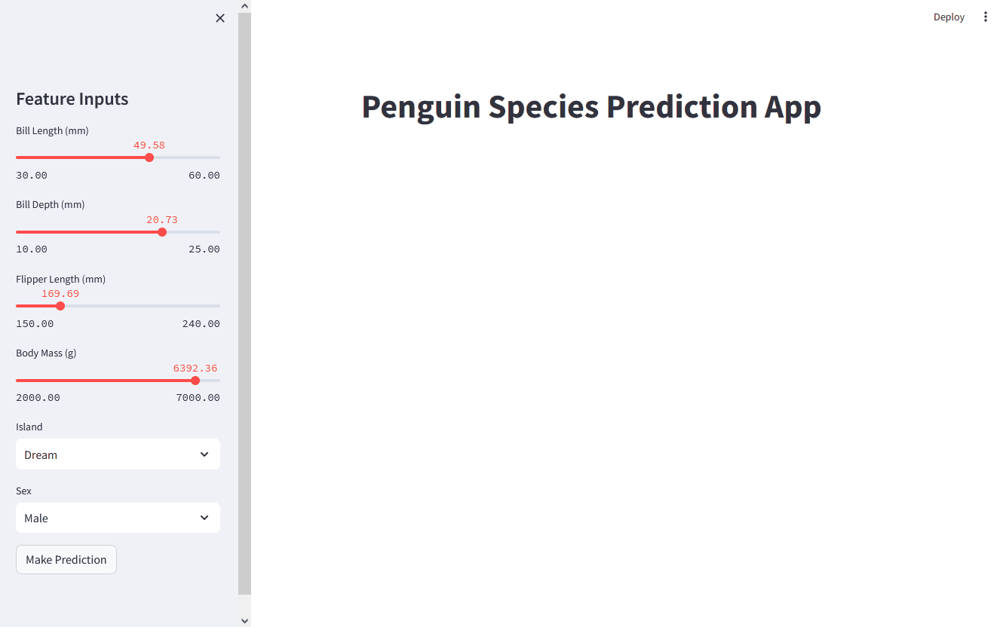

# Penguins Docker
Welcome to the Penguin Species Prediction App – a hands-on project as part of my MLOps course! This application leverages Streamlit, FastAPI, MongoDB, and Docker to create an interactive environment for predicting penguin species based on a carefully curated dataset.  

# Clone the project
To use the project you just have to download the files or clone the project.
To clone the project you can use the following command:  
`git clone https://github.com/arthurparmentier99/penguins-docker.git`

# Run the project
To run the project go in the main folder and run the following command:  
`docker compose up --build`  
Then you should be able to use the streamlit application at [http://localhost:8501/](http://localhost:8501/).  
The FastAPI documentation is available at [http://localhost:8000/docs](http://localhost:8000/docs).

# Demonstration
